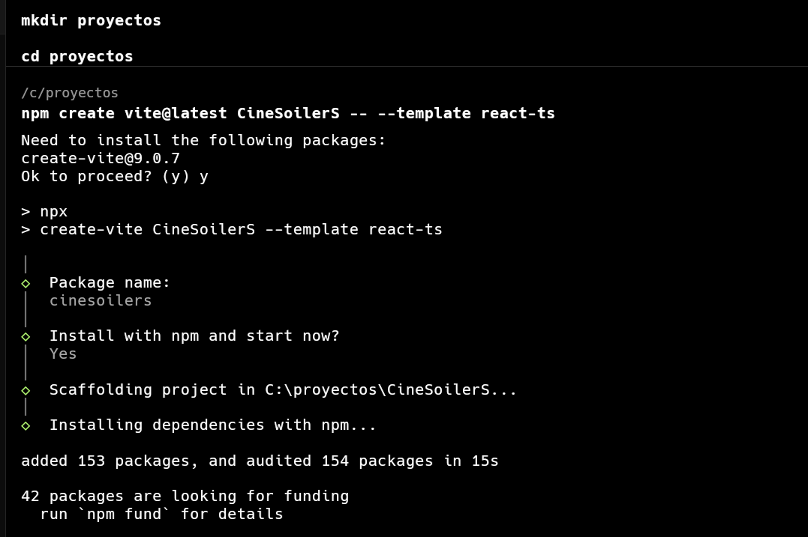
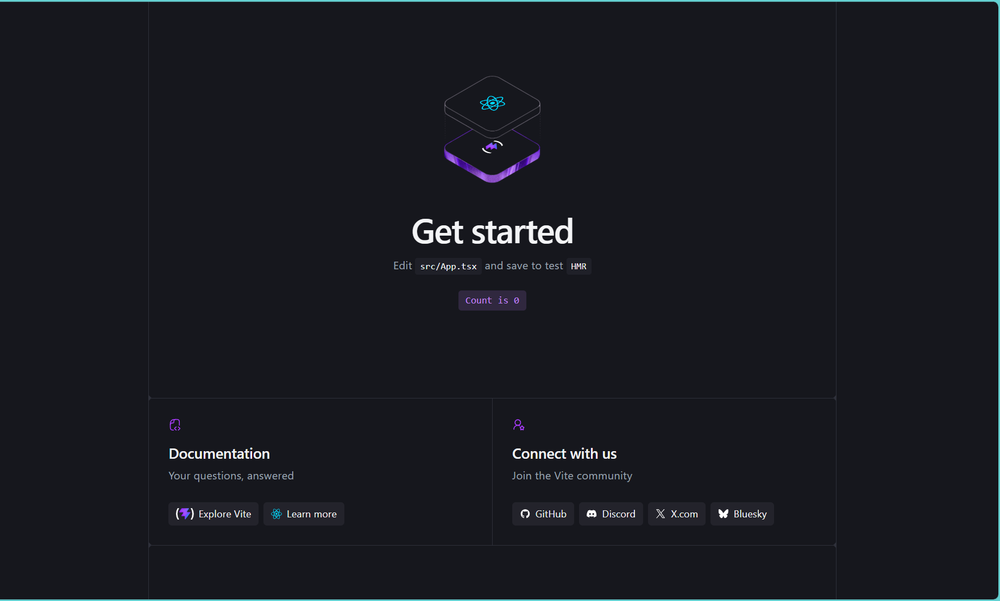
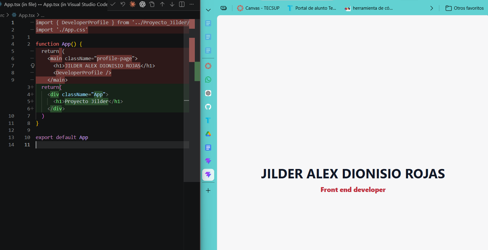
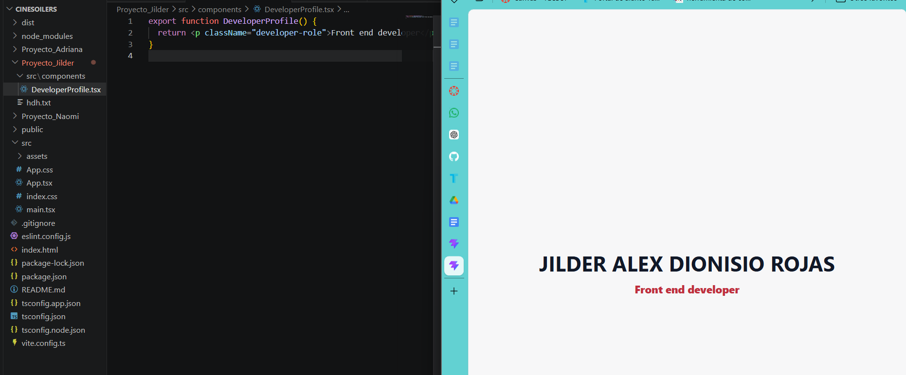

# CineSpoilerS

CineSpoilerS es un proyecto basico desarrollado con React, TypeScript y Vite.
El objetivo del trabajo es practicar la creacion de componentes, la organizacion de archivos y el trabajo colaborativo usando carpetas individuales para cada integrante.

## Entregables individuales por cada miembro del equipo

### Jilder Alex Dionisio Rojas

- Carpeta de trabajo: `Proyecto_Jilder`
- App principal: `Proyecto_Jilder/src/App.tsx`
- Componente entregado: `Proyecto_Jilder/src/components/DeveloperProfile.tsx`
- Texto del componente: `Front end developer`
- Texto mostrado en la app: `JILDER ALEX DIONISIO ROJAS`










### Naomi

- Carpeta de trabajo: `Proyecto_Jilder/Proyecto_Naomi`
- Archivo base: `Proyecto_Jilder/Proyecto_Naomi/tss.txt`
- Entregable individual pendiente de completar por la integrante.

### Adriana

- Carpeta de trabajo: `Proyecto_Jilder/Proyecto_Adriana`
- Archivo base: `Proyecto_Jilder/Proyecto_Adriana/jnfj.txt`
- Entregable individual pendiente de completar por la integrante.


Instalar dependencias:

```bash
cd Proyecto_Jilder
npm install
```

Ejecutar el proyecto:

```bash
cd Proyecto_Jilder
npm run dev
```

Generar version de produccion:

```bash
cd Proyecto_Jilder
npm run build
```
